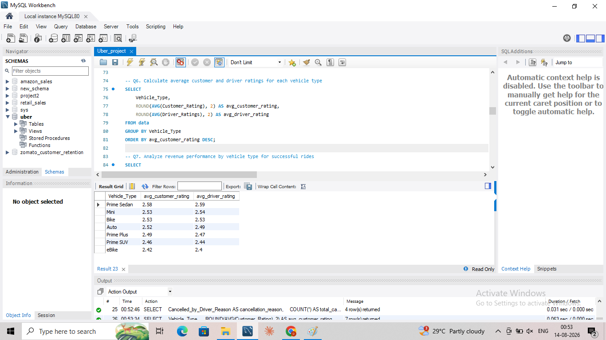
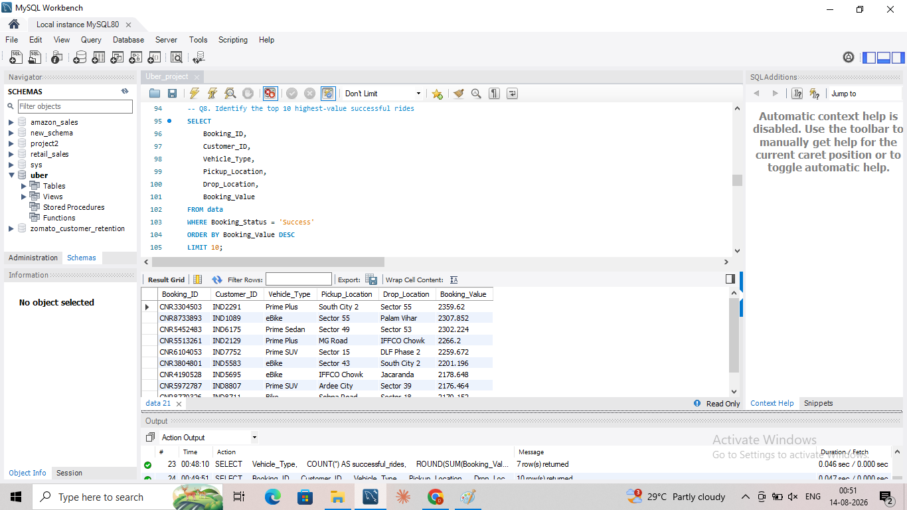

# 🚕 Uber Ride Analysis

A business-focused data analytics project using **MySQL, Microsoft Excel, and Power BI** to analyze Uber ride bookings, cancellations, customer behavior, vehicle performance, ratings, locations, and revenue.

## 📌 Project Overview

This project analyzes **10,000 Uber ride-booking records** from the provided dataset.

The workflow moves from raw data validation to SQL analysis and Power BI reporting:

**Raw Data → Data Validation → SQL Analysis → Power BI Dashboard → Business Insights**

The analysis focuses on understanding ride performance, operational issues, customer behavior, service quality, vehicle performance, and revenue.

## 🎯 Business Objectives

- Measure successful booking performance
- Understand customer and driver cancellation patterns
- Identify high-volume customers
- Compare vehicle types by distance, ratings, booking volume, and revenue
- Identify high-value bookings
- Understand common incomplete-booking reasons
- Identify high-performing pickup locations
- Compare customer and driver service ratings
- Evaluate revenue contribution by vehicle type

## 🗂️ Dataset

| Metric | Value |
|---|---:|
| Total Booking Records | 10,000 |
| Successful Bookings | 6,231 |
| Driver Cancellations | 1,808 |
| Incomplete Bookings | 1,249 |
| Customer Cancellations | 712 |
| Vehicle Types | 6 |

### Vehicle Types

- Auto
- Bike Lite
- Auto Sharing
- Bike
- Cab Economy
- Cab Premium

### Booking Statuses

- Success
- Cancelled by Driver
- Cancelled by Customer
- Incomplete

### Data Validation Note

The dataset contains **4 Booking IDs that appear more than once**. These records were not automatically removed because the repeated IDs correspond to different booking records and can represent legitimate repeated entries.

The project therefore treats duplicate Booking IDs as a **data-quality observation** rather than assuming they are invalid records.

## 🛠️ Tools & Skills

### Tools

- MySQL
- Microsoft Excel
- Power BI

### SQL Techniques

- Data validation
- Filtering
- GROUP BY
- Aggregate functions
- CASE statements
- Subqueries
- COUNT, SUM, AVG, MIN, MAX
- Percentage calculations
- Customer analysis
- Vehicle performance analysis
- Cancellation analysis
- Revenue analysis
- Location analysis

### Power BI

- KPI reporting
- Interactive dashboarding
- Vehicle performance analysis
- Revenue analysis
- Cancellation analysis
- Rating analysis
- Location analysis
- Business-focused visualization

## 🔍 SQL Analysis

The project contains **15 business-focused SQL analyses**:

1. Retrieve successful bookings
2. Calculate average ride distance by vehicle type
3. Calculate customer cancellation percentage
4. Identify the top 5 customers by booking volume
5. Analyze driver cancellation reasons
6. Compare customer and driver ratings by vehicle type
7. Analyze revenue performance by vehicle type
8. Identify the top 10 highest-value successful bookings
9. Analyze incomplete bookings by reason
10. Identify top pickup locations by successful booking volume and revenue
11. Analyze overall booking performance by status
12. Compare success and cancellation performance by vehicle type
13. Calculate the overall driver cancellation rate
14. Calculate revenue contribution by vehicle type
15. Identify top pickup locations by total booking volume

## 📊 Key Business Areas

### 🚗 Vehicle Performance

Compare vehicle types using ride distance, customer ratings, driver ratings, successful booking volume, and booking value.

### ❌ Cancellation Analysis

Measure customer and driver cancellation levels and identify the main reasons behind driver cancellations.

### 👥 Customer Behavior

Identify customers with the highest booking volume and investigate high-value bookings.

### 💰 Revenue Analysis

Measure total and average booking value for successful bookings and compare revenue contribution across vehicle types.

### 📍 Location Performance

Identify pickup locations generating the highest successful booking volume and booking value.

### ⭐ Service Quality

Compare customer and driver ratings across vehicle types to understand differences in service experience.

## 📸 Power BI Dashboard

The Power BI analysis is presented through selected SQL and dashboard result screenshots covering the key business areas.

### Revenue by Vehicle


### Pickup Location Performance


### Vehicle Ratings



### Driver Cancellation Reasons


### Highest-Value Bookings



## 💡 Business Value

This project demonstrates how raw ride-booking data can be transformed into **validated data, structured SQL analysis, interactive Power BI reporting, and actionable business insights**.

The analysis can support decisions related to:

- Vehicle allocation
- Cancellation reduction
- Customer retention
- Operational capacity
- Service quality
- Revenue optimization
- Pickup-location performance

## 📁 Repository Structure

```text
uber-ride-analysis/
│
├── README.md
│
├── data/
│   └── uber_data.csv
│
├── sql/
│   └── uber_ride_analysis.sql
│
└── screenshots/
    ├── revenue-by-vehicle.png
    ├── pickup-location-performance.png
    ├── vehicle-ratings.png
    ├── driver-cancellation-reasons.png
    └── highest-value-rides.png
```

## 👤 Author

**Rajan Kumar**  
Data Analyst | SQL | Power BI | Excel | Python

Open to Data Analyst, Business Analyst, and BI Analyst opportunities.
