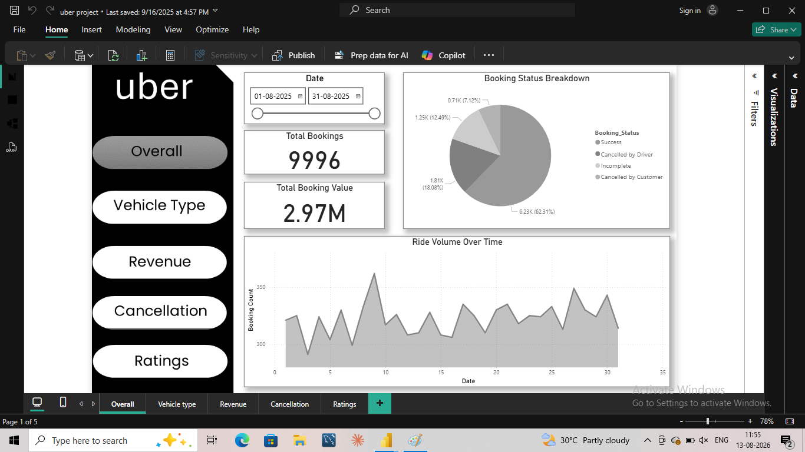
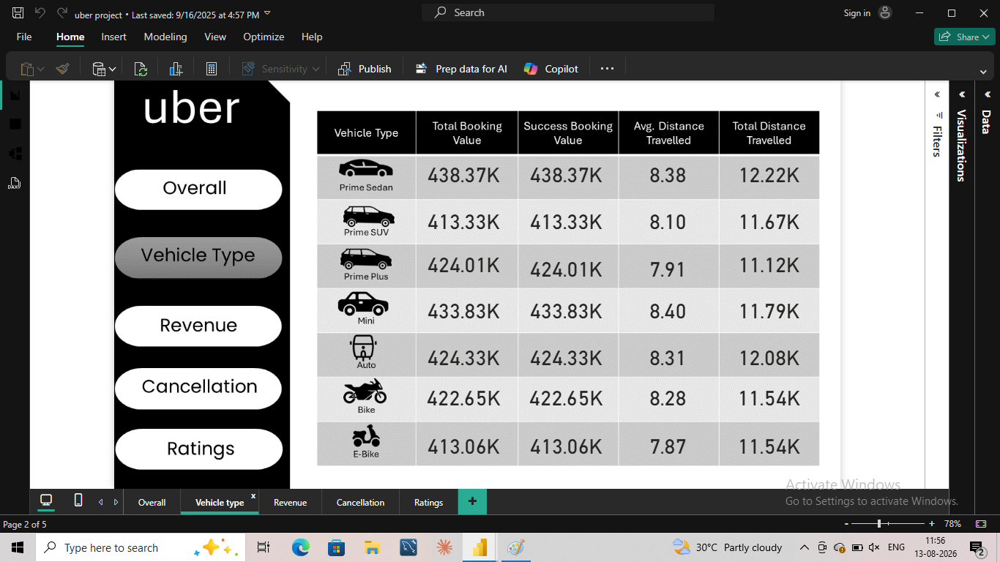
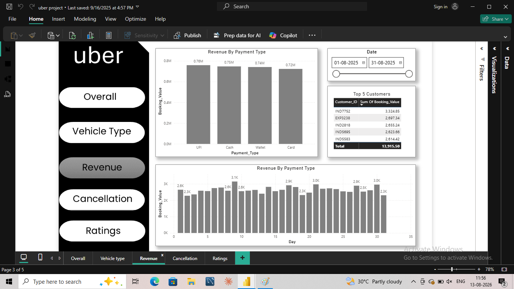
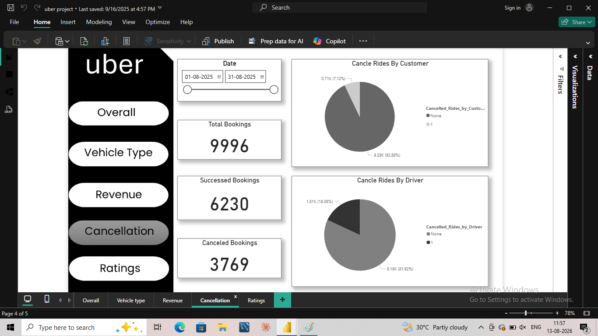
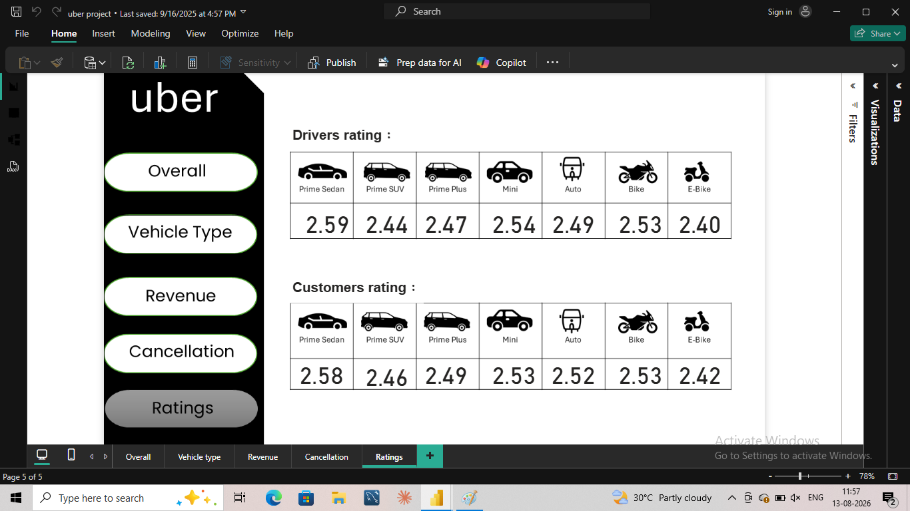
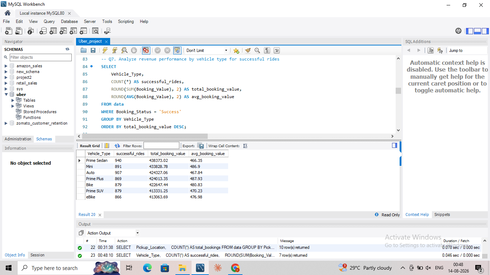
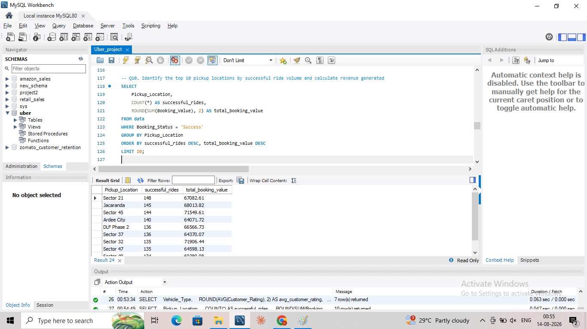
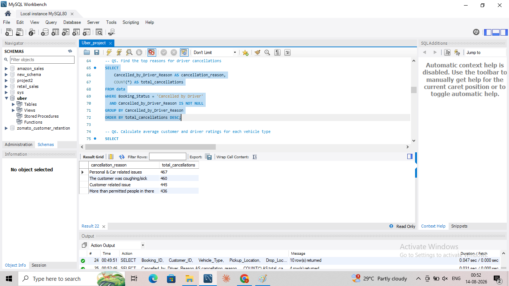

# 🚕 Uber Ride Analysis

**Business-focused ride-booking analysis using MySQL, Excel and Power BI to identify booking-funnel losses, cancellation patterns, vehicle performance and high-value pickup opportunities.**

## 🎯 Business Problem

A ride-hailing business needs to understand where bookings are being lost, which operational segments perform differently, and where revenue and service improvements should be prioritized.

This project follows an end-to-end workflow:

**Excel → Data Validation → MySQL SQL Analysis → Power BI → Business Insights**

### Core questions

- What percentage of bookings are successfully completed?
- How large are customer, driver and incomplete-booking losses?
- What are the main driver cancellation reasons?
- Which vehicle types contribute the most booking value and distance?
- Which pickup locations generate the most successful bookings and revenue?
- Where are service-quality and rating differences visible?

## 📊 Dataset Snapshot

| Metric | Result |
|---|---:|
| Total booking records | **10,000** |
| Successful bookings | **6,231 (62.3%)** |
| Driver cancellations | **1,808 (18.1%)** |
| Incomplete bookings | **1,249 (12.5%)** |
| Customer cancellations | **712 (7.1%)** |

The figures above show that the primary business opportunity is not only increasing demand, but also **reducing booking leakage across cancellations and incomplete rides**.

## 🔍 Data Validation

Before analysis, the dataset was reviewed for duplicate booking IDs and other data-quality issues. Repeated booking IDs were investigated rather than automatically deleted because they can represent distinct booking observations.

## 🧮 SQL Analysis

The project contains **15 business-focused SQL analyses** covering:

- Booking success and cancellation performance
- Customer and driver cancellation behavior
- Driver cancellation reasons
- Vehicle-level performance
- Revenue by vehicle type
- High-value bookings
- Pickup-location performance
- Incomplete-booking reasons
- Customer and driver ratings
- Booking-volume trends

### SQL techniques demonstrated

`GROUP BY` · Aggregations · `CASE WHEN` · Subqueries · Percentage calculations · `COUNT` · `SUM` · `AVG` · `MIN/MAX`

## 📈 Key Business Insights

### 1. Booking conversion is the central operational issue

Only **6,231 of 10,000 bookings (62.3%) were successful**. The remaining bookings include driver cancellations, customer cancellations and incomplete rides.

**Business implication:** A meaningful share of demand does not convert into completed rides.

**Recommendation:** Prioritize the booking funnel by separating driver-side cancellations, customer cancellations and incomplete rides, then address the largest failure reasons individually.

### 2. Driver cancellations are the largest identified cancellation segment

There were **1,808 driver cancellations (18.1% of all bookings)** compared with **712 customer cancellations (7.1%)**.

**Business implication:** Driver-side behavior represents a larger immediate source of booking loss than customer cancellations in this dataset.

**Recommendation:** Investigate the most common driver cancellation reasons and use them to guide driver allocation, incentive and service-coverage decisions.

### 3. Incomplete bookings represent another significant leakage point

**1,249 bookings (12.5%)** were classified as incomplete.

**Business implication:** Improving completion requires more than reducing cancellations; incomplete rides should be investigated as a separate operational failure category.

**Recommendation:** Analyze incomplete-ride reasons and identify whether the issue is concentrated by vehicle type, pickup location or time period.

### 4. Vehicle and location analysis can guide operational prioritization

The SQL and Power BI analysis compares vehicle types using booking value, successful-booking value, average distance and total distance, while pickup-location analysis identifies high-volume locations by successful bookings and revenue.

**Recommendation:** Combine vehicle-level performance with pickup demand when planning capacity and allocation rather than evaluating either dimension independently.

### Analytical caution

The project identifies operational associations and performance differences. It does not claim that a specific vehicle type, location or cancellation reason is causal without further investigation.

## 📊 Power BI Dashboard

The five-page Power BI report is structured around business questions rather than standalone charts.

### 1. Overall

Tracks total bookings, successful bookings, booking-status distribution and booking volume over time.



### 2. Vehicle Type

Compares vehicle categories by booking value, successful-booking value, average distance and total distance.



### 3. Revenue

Analyzes booking value by payment type, high-value customers and time trends.



### 4. Cancellation

Examines customer and driver cancellation patterns and the operational areas requiring attention.



### 5. Ratings

Compares customer and driver ratings across vehicle types to evaluate service quality.



## 🔎 Selected SQL Results

### Revenue by Vehicle


### Pickup Location Performance


### Vehicle Ratings


### Driver Cancellation Reasons


### Highest-Value Rides


## 💡 Business Value

The analysis translates ride-booking data into decisions around:

- Booking conversion
- Cancellation reduction
- Driver operations
- Vehicle allocation
- Service quality
- Revenue optimization
- Pickup-location capacity

## 🛠️ Tools & Skills

**MySQL / SQL:** Aggregations, joins, filtering, `CASE`, subqueries, percentage calculations and business analysis.

**Power BI:** KPI reporting, interactive dashboards, vehicle analysis, revenue analysis, cancellation analysis, ratings and trends.

**Excel:** Data preparation and validation.

## 📁 Repository Structure

```text
uber-ride-analysis/
├── README.md
├── data/uber_data.xlsx
├── sql/uber_ride_analysis.sql
└── screenshots/
    ├── power-bi/
    └── sql/
```

## 🚀 Portfolio Takeaway

This project demonstrates an analyst workflow from **raw booking data → validation → SQL investigation → interactive reporting → operational recommendations**, with a focus on identifying where bookings are lost and where operational improvements can have the greatest value.

**Portfolio status: Interview-ready case study.**

## 👤 Author

**Rajan Kumar**  
Data Analyst | SQL | Power BI | Excel | Python
